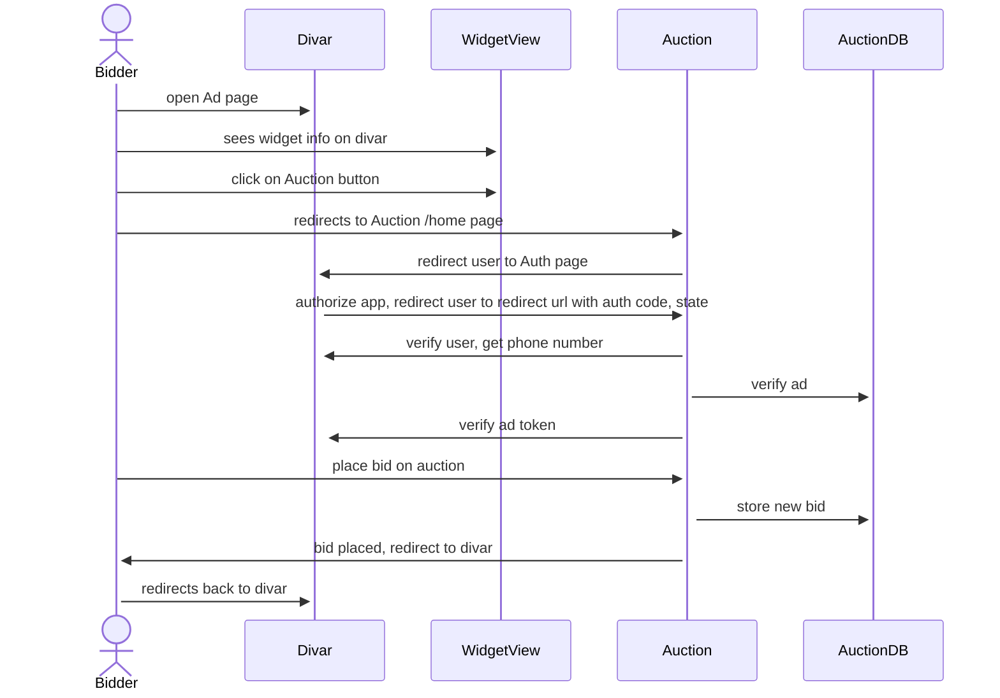

### Auction Flows

#### Placing a bid

```mermaid
sequenceDiagram
    actor Bidder
    participant Divar
    participant WidgetView
    participant Auction
    Bidder->>+Divar: open Ad page
    Bidder->>+WidgetView: sees widget info on divar
    Bidder->>+WidgetView: click on Auction button
    Bidder->>+Auction: redirects to Auction /home page
    Auction->>+Divar: redirect user to Auth page
    Divar->>Auction: authorize app, redirect user to redirect url with auth code, state
    Auction->>+Divar: verify user, get phone number
    Auction->>+AuctionDB: verify ad
    Auction->>+Divar: verify ad token
    Bidder->>+Auction: place bid on auction
    Auction->>+AuctionDB: store new bid
    Auction->>+Bidder: bid placed, redirect to divar
    Bidder->>+Divar: redirects back to divar
```
