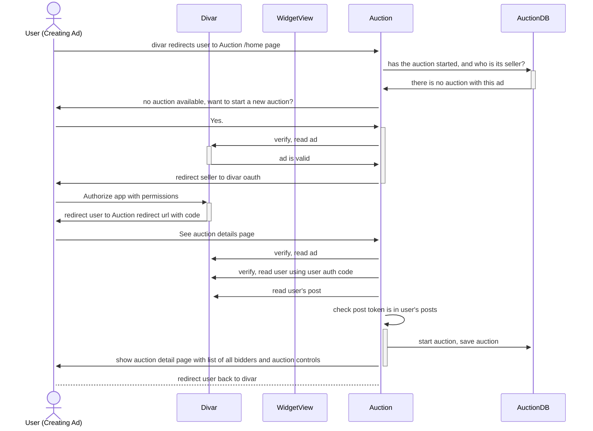

### Project Setup
- install [uv](https://docs.astral.sh/uv/getting-started/installation)
- clone this project
- cd into project root directory
- create .env file from .template.env, set variables
- run ```make LANG=fa compilemessages``` to build translations
- run ```$ PORT=8080 sh scripts/run.sh```

### Translations
1. create translation message file in a language by runnings ```make LANG=fa makemessages```
2. translate text in auction/locale/fa/LC_MESSAGES/messages.po
3. run ```make LANG=fa compilemessages```

### Auction Flows

### Auction details page
- when auction exists (started) and the user entering details page is the seller (auction owner):


---

- when auction not exists (not started yet) and the user entering details page want to start an auction:



---

- when auction exists (started) and the user entering details page is not the seller and wants to place a bid:


#### Placing a bid


